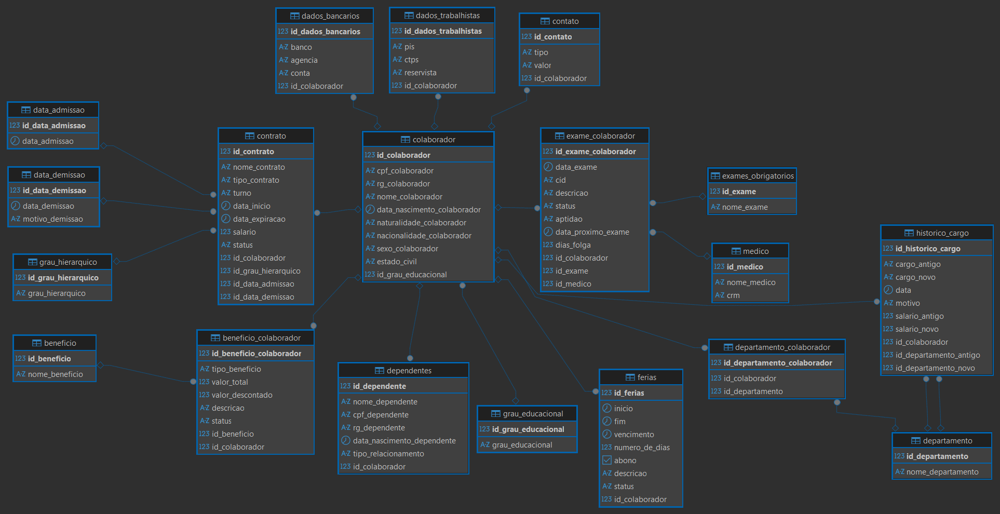

# 🏢 Sistema de Gestão Empresarial + Modelagem de Banco de Dados

Projeto de modelagem e implementação de um banco de dados relacional para representar e organizar informações relacionadas à gestão de colaboradores de uma empresa.

O projeto contempla informações como dados pessoais e trabalhistas, contratos, departamentos, benefícios, dependentes, férias, exames ocupacionais e histórico de movimentações dos colaboradores.

---

## 📌 Sobre o projeto

O objetivo do projeto é aplicar conceitos de **modelagem de banco de dados relacional**, identificando entidades, atributos, relacionamentos e cardinalidades para estruturar as informações de uma empresa.

Além da modelagem inicial, foi proposta uma melhoria por meio da criação da entidade `historico_cargo`, responsável por armazenar informações sobre mudanças de cargo, alterações salariais e movimentações entre departamentos.

---

## 🗂️ Modelagem do banco de dados

O banco foi estruturado a partir de diferentes entidades relacionadas ao contexto empresarial.

### Principais entidades

- `colaborador`
- `dados_trabalhistas`
- `dados_bancarios`
- `contrato`
- `departamento`
- `beneficio`
- `dependentes`
- `ferias`
- `grau_educacional`
- `grau_hierarquico`
- `exame_colaborador`
- `exames_obrigatorios`
- `medico`
- `contato`
- `historico_cargo`

Também foram utilizadas entidades associativas para representar relacionamentos entre os dados:

- `departamento_colaborador`
- `beneficio_colaborador`

O modelo contempla relacionamentos **1:1, 1:N e N:N**.

---

## 🧩 Diagrama do banco de dados



---

## 🔗 Alguns relacionamentos do modelo

### Colaborador e dados trabalhistas

Cada colaborador possui informações relacionadas aos seus dados trabalhistas.

```text
colaborador 1 ───── 1 dados_trabalhistas
````

### Colaborador e dependentes

Um colaborador pode possuir vários dependentes.

```text
colaborador 1 ───── N dependentes
```

### Colaborador e departamento

A relação entre colaboradores e departamentos é representada pela entidade associativa `departamento_colaborador`.

```text
colaborador
      │
      ▼
departamento_colaborador
      │
      ▼
departamento
```

### Colaborador e benefícios

Um colaborador pode possuir diferentes benefícios, enquanto um benefício pode estar associado a diferentes colaboradores.

```text
colaborador
      │
      ▼
beneficio_colaborador
      │
      ▼
beneficio
```

### Histórico de cargos

A entidade `historico_cargo` foi adicionada como uma melhoria ao projeto para registrar movimentações profissionais dos colaboradores.

Ela armazena informações como:

* cargo antigo;
* cargo novo;
* data da alteração;
* motivo;
* salário antigo;
* salário novo;
* departamento antigo;
* departamento novo.

---

# 💻 Consultas SQL

O projeto também inclui consultas SQL para recuperar e analisar informações armazenadas no banco de dados.

Abaixo estão alguns exemplos.

---

## 1. Colaboradores ativos por departamento

Esta consulta utiliza múltiplos `JOINs` para relacionar colaboradores, contratos e departamentos, filtrando os colaboradores ativos de um departamento específico.

```sql
SELECT c.id_colaborador, c.nome_colaborador, d.nome_departamento
FROM colaborador c
JOIN contrato ct ON c.id_colaborador = ct.id_colaborador
JOIN departamento_colaborador dc ON c.id_colaborador = dc.id_colaborador
JOIN departamento d ON dc.id_departamento = d.id_departamento
WHERE ct.status = 'Ativo'
  AND d.nome_departamento = 'TI';
```

**Conceitos utilizados:**

* `JOIN`
* `WHERE`
* relacionamento entre múltiplas tabelas

---

## 2. Custo de benefícios por departamento

Esta consulta calcula o valor total dos benefícios, os descontos e o custo líquido para a empresa, agrupando os resultados por departamento.

```sql
SELECT d.nome_departamento,
       SUM(bc.valor_total) AS custo_total,
       SUM(bc.valor_descontado) AS total_descontado,
       SUM(bc.valor_total - bc.valor_descontado) AS custo_liquido_empresa
FROM beneficio_colaborador bc
JOIN colaborador c ON bc.id_colaborador = c.id_colaborador
JOIN departamento_colaborador dc ON c.id_colaborador = dc.id_colaborador
JOIN departamento d ON dc.id_departamento = d.id_departamento
WHERE bc.status = 'Ativo'
GROUP BY d.nome_departamento;
```

**Conceitos utilizados:**

* `JOIN`
* `SUM()`
* `GROUP BY`
* cálculos e agregações

---

## 3. Histórico de promoções de um colaborador

A consulta permite visualizar as mudanças de cargo e salário de um colaborador ao longo do tempo.

```sql
SELECT c.nome_colaborador,
       h.cargo_antigo,
       h.cargo_novo,
       h.salario_antigo,
       h.salario_novo,
       h.data,
       h.motivo
FROM historico_cargo h
JOIN colaborador c ON h.id_colaborador = c.id_colaborador
WHERE c.nome_colaborador = 'Carlos Andrade'
ORDER BY h.data DESC;
```

**Conceitos utilizados:**

* `JOIN`
* `WHERE`
* `ORDER BY`
* consulta de dados históricos

---

## 4. Último cargo de cada colaborador

Esta consulta utiliza uma subconsulta para identificar o registro mais recente no histórico de cada colaborador.

```sql
SELECT c.nome_colaborador,
       h.cargo_novo,
       h.salario_novo,
       h.data
FROM historico_cargo h
JOIN colaborador c ON h.id_colaborador = c.id_colaborador
WHERE h.data = (
    SELECT MAX(h2.data)
    FROM historico_cargo h2
    WHERE h2.id_colaborador = h.id_colaborador
);
```

**Conceitos utilizados:**

* `JOIN`
* Subquery
* `MAX()`
* consulta de registros históricos

---

## 🛠️ Tecnologias e conceitos utilizados

* SQL
* Modelagem de Dados
* Banco de Dados Relacional
* Chaves Primárias e Estrangeiras
* Relacionamentos entre tabelas
* Cardinalidades
* Funções de agregação
* Subqueries

---


## 💡 Possíveis evoluções

Algumas possíveis evoluções para o projeto:

* desenvolvimento de uma API para acesso aos dados;
* criação de uma interface para gerenciamento das informações;
* desenvolvimento de dashboards para análise dos dados;
* implementação de autenticação e controle de acesso;
* integração com outras fontes de dados.

---

## 👩‍💻 Autora

**Isabel de Freitas**

Projeto desenvolvido para aplicação prática de conceitos de **modelagem e implementação de bancos de dados relacionais** e analise de dados.

````
